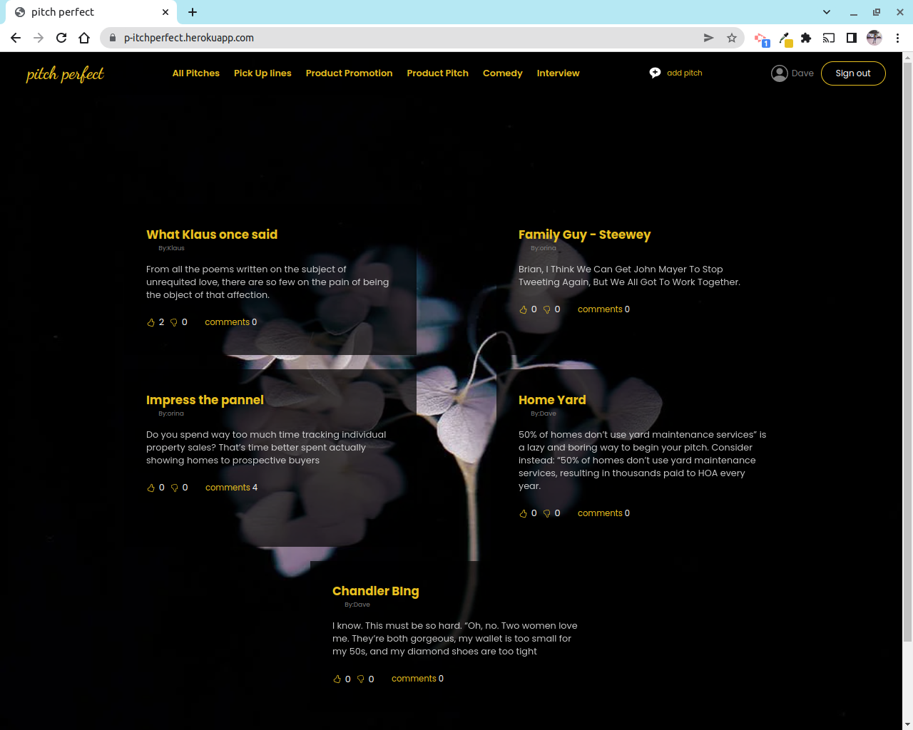

# pitch

## Table of Content

- [Description](#description)
- [Installation Requirement](#Installation)
- [Technology Used](#technology-used)
- [Reference](#reference)
- [Licence](#licence)
- [Authors Info](#author-Info)
- [ToDO](#To-Do)

 
<h1>Home</h1>

 
 

 

## Description

pitchPerfect  application that allows users to use that one minute wisely. The users will submit their one minute pitches and other users will vote on them and leave comments to give their feedback on them. 

See Live site <a href="https://p-itchperfect.herokuapp.com/">here<a/> 

## Installation

<code>
<ul>
<li>Git clone This repo.</li>
<li>python3 -m venv virtual - to install virtual enviroment.</li>
<li>Source virtual/bin/activate - to install flask.</li>
<li>pip list to show all needed packages are installed inside the virtual environment.</li>
<li>Refer to requirements.txt to see required packages.</li>
</ul>
</code>

## Technology Used

<ul>
<li>
python3.9.5
 </li>
  <li>
Flask 2.0.0
 </li>
<li>
pip3
</li>
<li>
PSQL 
</li>
<li>
Javascript
</li>
</ul>

## Reference

- <a href="https://flask.palletsprojects.com/en/2.1.x/">FLASK Documentation - https://flask.palletsprojects.com/en/2.1.x/</a>

## Licence

   copyright © Charity 2022 - <a href="https://github.com/charity-bit/pitches/blob/main/LICENSE">MIT</a>

## Authors Info

-LinkedIn - [Charity Nyanchera](https://www.linkedin.com/in/charitynyanchera)

-twitter - [CcNyanchera](https://twitter.com/CcNyanchera)

-[Go Back to the top](#pitch)
